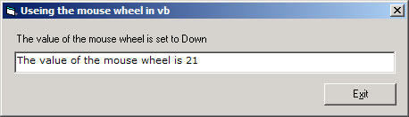



## MouseWheel Support

### Description

Hi this is a little bit of code that I did athat allow you to have mouse support in Visual Basic it only a small example and I am not sure that it 100% correct but it seems to work for what I need you can make a value go up and down in a text box

anyway I hope you may find it usfull
 
### More Info
 

             |
---                |---
**Submitted On**   |2003-02-17 09:12:04
**By**             |[dreamvb](https://github.com/Planet-Source-Code/PSCIndex/blob/master/ByAuthor/dreamvb.md)
**Level**          |Beginner
**User Rating**    |5.0 (20 globes from 4 users)
**Compatibility**  |VB 6\.0
**Category**       |[Windows API Call/ Explanation](https://github.com/Planet-Source-Code/PSCIndex/blob/master/ByCategory/windows-api-call-explanation__1-39.md)
**World**          |[Visual Basic](https://github.com/Planet-Source-Code/PSCIndex/blob/master/ByWorld/visual-basic.md)
**Archive File**   |[MouseWheel1545942172003\.zip](https://github.com/Planet-Source-Code/dreamvb-mousewheel-support__1-43297/archive/master.zip)

